# d3demos

## [主界面](https://victorcheney.github.io/d3demos/index.html)

|### 1、[径向堆积柱状图](https://victorcheney.github.io/d3demos/examples/RadialStackedBar/index.html)

### 2、[带可编辑注释的折线图](https://victorcheney.github.io/d3demos/examples/riseOfBitcoin/index.html)

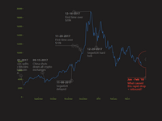

### 3、[分层条形图](https://victorcheney.github.io/d3demos/examples/hierarchicalBarChart/index.html)

### 4、[排序柱状图](https://victorcheney.github.io/d3demos/examples/sortableBarChart/index.html)

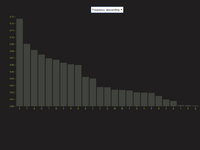

### 5、[在螺旋曲线上显示随时间变化的数据](https://victorcheney.github.io/d3demos/examples/condegramSpiralPlot/index.html)

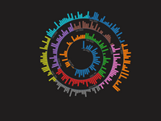

### 6、[横向实时图表](https://victorcheney.github.io/d3demos/examples/realtimeHorizonChart/index.html)

### 7、[堆状条形图分组条形图切换](https://victorcheney.github.io/d3demos/examples/stackedToGroupedBars/index.html)

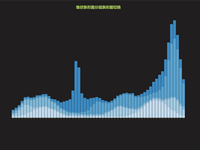

### 8、[面积图](https://victorcheney.github.io/d3demos/examples/areaChart/index.html)

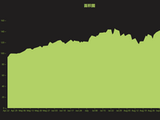

### 9、[折叠树状图](https://victorcheney.github.io/d3demos/examples/areaChart/index.html)

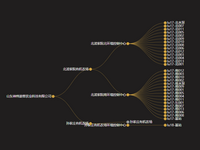

### 10、[折线图](https://victorcheney.github.io/d3demos/examples/linechart/index.html)

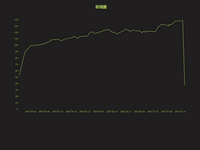

### 11、[柱状图](https://victorcheney.github.io/d3demos/examples/barchart/index.html)

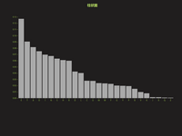

### 12、[饼图](https://victorcheney.github.io/d3demos/examples/piechart/index.html)

### 13、[环形图](https://victorcheney.github.io/d3demos/examples/donutchart/index.html)

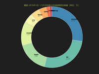

### 14、[带标签环形图](https://victorcheney.github.io/d3demos/examples/piechartlabels/index.html)

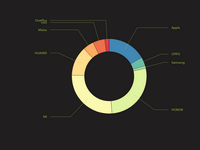

### 15、[矩阵图](https://victorcheney.github.io/d3demos/examples/matrixdiagram/index.html)

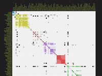

### 16、[NBA球员数据](https://victorcheney.github.io/d3demos/examples/nbaplayerpoints/index.html)

